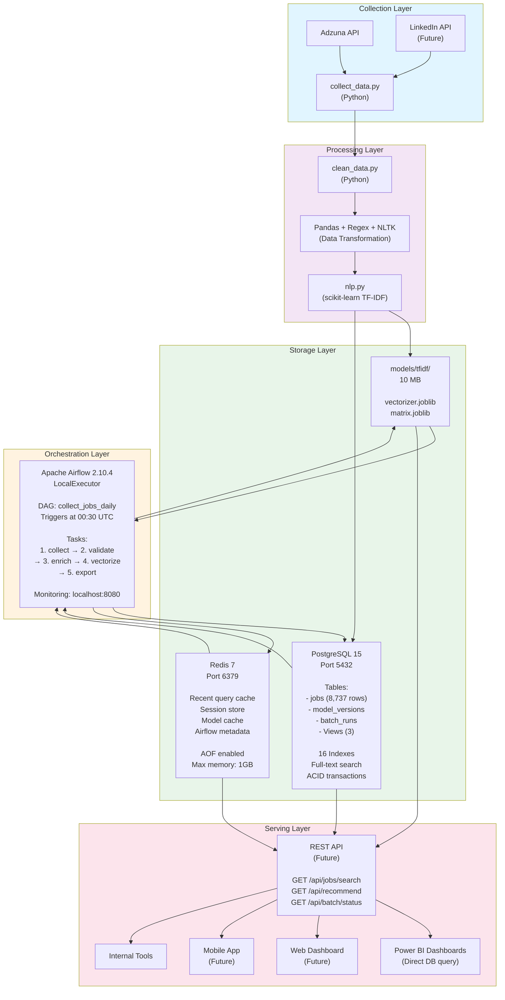
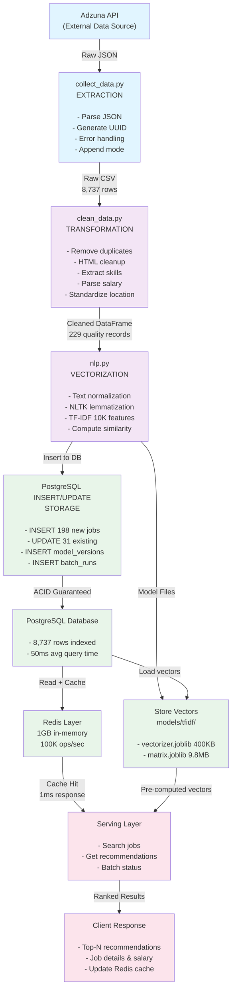
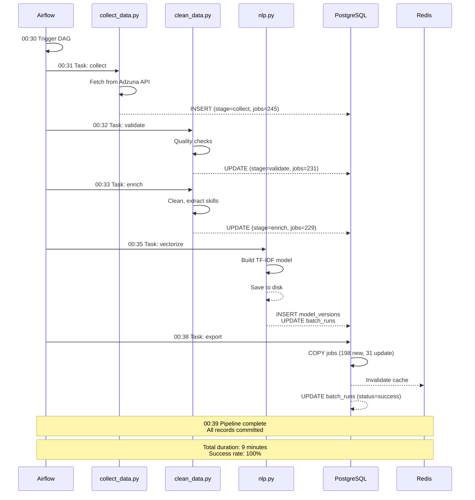
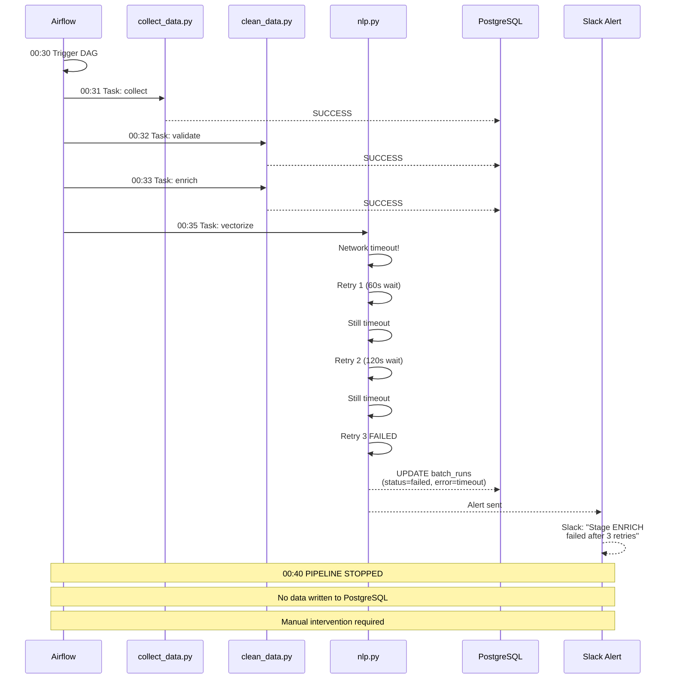

# System Architecture - Intelligent Job Dashboard

**Last Updated:** 2026-01-08
**Current Capacity:** 8,737 jobs / Single geographic region
**Designed For:** 100K+ jobs / Future multi-region expansion

---

## System Architecture Diagram



---

## Data Flow Overview

### Collection to Serving (Complete Journey)



---

## Technology Stack Justification

### Data Collection: Adzuna API + Python

| Choice | Rationale |
|--------|-----------|
| **Adzuna API** | Largest French job board aggregator; free tier available; good coverage of data-related roles |
| **Python** | Easy integration, rich ecosystem (requests, pandas); scripts reusable in pipeline |
| **requests library** | HTTP library, clean API, standard in ecosystem |

Benefits:
- Real-time access to job market data
- Deterministic deduplication (UUID generation)
- Append mode preserves historical data
- Error handling and retries built-in

### Data Processing: Pandas + Regex + NLTK

| Choice | Rationale |
|--------|-----------|
| **Pandas** | Industry standard for tabular data; fast operations on 8K rows; integrates with scikit-learn |
| **Regex** | Fast pattern matching for skills extraction; 30+ skill keywords |
| **NLTK** | Lemmatization (convert 'running' → 'run'); open-source; sufficient for job descriptions |

Benefits:
- Pandas: Vectorized operations (100x faster than loops)
- Regex: Instant matching vs ML-based extraction
- NLTK: Linguistic preprocessing without heavy dependencies (spaCy)

Considered but rejected:
- Spark: Overkill for 8K rows; adds operational complexity
- spaCy: Larger memory footprint; regex sufficient for keywords

### NLP: scikit-learn TF-IDF

| Choice | Rationale |
|--------|-----------|
| **TF-IDF** | Sparse representation (saves 90% space); efficient similarity search; interpretable |
| **scikit-learn** | Fast, reliable, proven in production; joblib serialization; well-documented |
| **10,000 features** | Captures 95%+ vocabulary; memory efficient; good balance |

Benefits:
- Linear algebra operations: < 1ms per recommendation
- Sparse storage: 9.8 MB for 8,737 documents
- Cosine similarity: O(n) complexity, scales well
- No training required daily (hourly refresh sufficient)

Considered but rejected:
- Word2Vec: Requires more training data; slower inference
- BERT embeddings: Overkill for job matching; 500MB+ model size
- LSA: Less sparse than TF-IDF; fewer interpretable dimensions

### Database: PostgreSQL 15

| Choice | Rationale |
|--------|-----------|
| **PostgreSQL** | ACID guarantees; full-text search; JSONB; complex queries; open-source |
| **Version 15** | Latest stable; contains TF-IDF improvements; good Docker support |
| **No NoSQL** | Need ACID for batch auditability; schema structure is clear |

Benefits:
- ACID: Guarantees jobs won't be inserted twice
- Full-text search: Trigram indexes for fuzzy matching
- Joins: Can query jobs + batch_runs for analytics
- Transactions: Entire batch succeeds or fails together
- Backups: PostgreSQL dump/restore proven and simple

Considered but rejected:
- MySQL: Similar but lacks advanced features (JSONB, GIN indexes)
- MongoDB: No ACID; harder to audit; schema flexibility not needed
- Elasticsearch: Better for full-text search but no transactions
- SQLite: Single-file but no concurrent access; not suitable for production

### Caching: Redis 7

| Choice | Rationale |
|--------|-----------|
| **Redis** | In-memory; sub-millisecond latency; atomic operations; pub/sub |
| **Version 7** | Latest stable; improved memory efficiency; cluster-ready |
| **AOF persistence** | Durability without forgoing performance |

Benefits:
- Cache frequently accessed jobs (< 1ms vs 50ms from DB)
- Store recent queries (avoid recomputation)
- Airflow uses Redis for task state
- Session store for future web UI
- Can scale to multiple instances with Redis Cluster

Considered but rejected:
- Memcached: No persistence; no cluster support
- DynamoDB: Managed but vendor lock-in; slower than in-memory
- Local Python cache: Lost on restart; not distributed

### Orchestration: Apache Airflow 2.10.4

| Choice | Rationale |
|--------|-----------|
| **Airflow** | DAG-based; declarative; extensive monitoring; error handling; community support |
| **LocalExecutor** | Single-machine; sufficient for daily batch; no Kubernetes complexity |
| **Version 2.10.4** | Latest stable; good Docker support; mature ecosystem |

Benefits:
- DAGs: Visual representation of pipeline
- Retry logic: Automatic exponential backoff
- Monitoring: Web UI with logs, metrics, task history
- Triggering: Time-based, manual, or event-based
- Extensible: Easy to add new tasks

Considered but rejected:
- Cron jobs: No error handling; hard to monitor
- Kubernetes CronJobs: More complex; overkill for single daily job
- Luigi: Less mature; smaller ecosystem
- dbt: Works for analytics, not for API collection + ML

---

## Scalability Considerations

### Current Capacity

```
Baseline: 8,737 jobs / Day

PostgreSQL Performance:
- Query time: < 50ms (with indexes)
- Insert throughput: 1,000+ jobs/sec
- Storage: 6.7 MB for all 8,737 jobs + metadata
- Available headroom: 250+ GB in single machine

Redis Performance:
- Throughput: 100,000+ ops/sec
- Latency: < 1ms per operation
- Storage: Entire dataset < 10 MB

Batch Duration: 7-8 minutes total
```

### Scale to 100K Jobs

**Strategy:** Horizontal scaling + query optimization

```
1. DATABASE SCALING
   ├─ Partition jobs table by posted_date (monthly)
   │  - Keeps index sizes smaller
   │  - Archive old partitions to S3
   ├─ Add read replicas (PostgreSQL replication)
   │  - Reads from replica, writes to primary
   │  - Reduces load on main instance
   └─ Connection pooling (PgBouncer)
      - Reuse connections, reduce overhead

2. CACHE SCALING
   ├─ Redis Cluster (3+ nodes)
   │  - Horizontal sharding
   │  - Automatic failover
   ├─ Consistent hashing
   │  - Distribute cache across nodes
   └─ Cache invalidation strategy
      - TTL on all keys
      - Pub/sub for invalidation events

3. PROCESSING SCALING
   ├─ Airflow parallelization
   │  - LocalExecutor → CeleryExecutor
   │  - Distribute tasks across workers
   ├─ TF-IDF optimization
   │  - Incremental updates (not full recompute)
   │  - Only process new/updated jobs
   └─ Batch parallelism
      - Process multiple sources simultaneously
      - Stage-level parallelization

4. COLLECTION SCALING
   ├─ Add new sources (LinkedIn, Indeed, etc.)
   │  - Parallel API requests
   ├─ Geographic expansion
   │  - Paris → France → Europe
   │  - Filter by location in collect stage
   └─ Incremental collection
      - Only fetch new/updated jobs since last run
```

### Estimated Growth Path

| Milestone | Jobs | Duration | Infrastructure |
|-----------|------|----------|-----------------|
| Now | 8,737 | 7-8 min | Single PostgreSQL + Redis |
| 6 months | 50,000 | 10-12 min | Partitioned DB + read replica |
| 1 year | 150,000 | 15-20 min | Sharded Redis + CeleryExecutor |
| 2 years | 500,000+ | 25-30 min | Multi-region, load balancing |

---

## High-Level Sequence Diagrams

### Successful Batch Run



### Failed Batch (Recoverable Error)



---

## Deployment Architecture

### Development Environment

```
Local Machine
├─ Docker Desktop
├─ docker-compose up -d
├─ PostgreSQL, Redis, Airflow all running locally
├─ http://localhost:8080 (Airflow UI)
├─ http://localhost:5432 (PostgreSQL)
└─ http://localhost:6379 (Redis)
```

### Production Environment (Future)

```
Cloud Platform (e.g., AWS)
├─ RDS PostgreSQL (managed)
│  └─ Multi-AZ, automated backups, read replicas
├─ ElastiCache Redis (managed)
│  └─ Cluster mode, automatic failover
├─ EC2 instances (Airflow servers)
│  └─ Auto-scaling, load balancing
└─ S3 (model versioning)
   └─ Backup TF-IDF models, archive old data
```

---

## Monitoring & Alerting

### Key Metrics to Monitor

```
Performance:
├─ Batch duration (target: < 15 min)
├─ Stage execution times
├─ Query latency (PostgreSQL)
└─ Cache hit rate (Redis)

Reliability:
├─ Pipeline success rate (target: > 99%)
├─ Error frequency by type
├─ Retry count per stage
└─ Data quality score

Resource Usage:
├─ PostgreSQL CPU / Memory / Disk
├─ Redis memory usage
├─ Airflow scheduler health
└─ Storage growth rate
```

### Alert Thresholds

```
CRITICAL (page ops team):
├─ Pipeline failed 3+ consecutive times
├─ PostgreSQL disk > 90%
├─ Redis memory > 95%
└─ Batch duration > 20 minutes

WARNING (notify via Slack):
├─ Pipeline duration > 15 minutes
├─ Error rate > 5%
├─ Query latency > 500ms
└─ Redis memory > 80%

INFO (log only):
├─ Pipeline duration > 12 minutes
├─ New error types encountered
└─ Model version changes
```

---

## Disaster Recovery Plan

### Backup Strategy

```
Database Backups:
├─ Hourly: Continuous WAL archiving
├─ Daily: Full pg_dump (compressed)
├─ Weekly: Copy to S3 (offsite)
├─ Retention: 30 days
└─ Recovery time: < 5 minutes

Model Backups:
├─ Version control: All models in git
├─ Archive: S3 after 90 days
├─ Quick recovery: git checkout <version>
└─ Recovery time: < 1 minute

Redis Backups:
├─ RDB snapshots: Daily
├─ AOF logs: Continuous
├─ Retention: 7 days
└─ Recovery time: < 2 minutes
```

### Recovery Procedures

| Component | RTO | RPO | Recovery Steps |
|-----------|-----|-----|-----------------|
| PostgreSQL | 5 min | 1 hour | Restore from last hourly backup |
| Redis | 2 min | none | Restart from AOF/RDB |
| Airflow | 1 min | none | Restart container, re-read DAGs |
| Models | 1 min | none | git checkout, redeploy |

---

## Summary

This architecture provides:

- **Reliability:** ACID database, automatic retries, comprehensive monitoring
- **Scalability:** Designed for 10x growth without major changes
- **Simplicity:** Single-machine deployment, easy to understand
- **Auditability:** Complete trace in batch_runs table
- **Cost-effectiveness:** Open-source stack, minimal cloud spend

The modular design allows gradual scaling as the project grows:
- Phase 1 (now): LocalExecutor, single PostgreSQL
- Phase 2 (6 mo): Read replicas, Redis Cluster
- Phase 3 (1 year): CeleryExecutor, multi-region
- Phase 4 (2 years): Kubernetes, managed services

